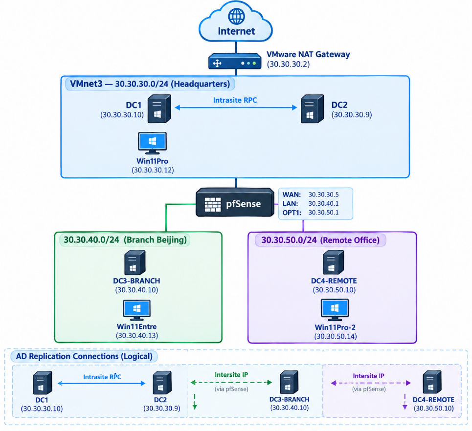

# AD DS Home Lab — Learning Journal

**KARAKIRE O'Neil** | September 2026

---

## Active Directory Domain Services — Core Concepts

A **forest** is the top-level security boundary in Active Directory. My lab forest is oneil.local.

A **tree** is a collection of domains that share the same contiguous namespace under a forest. For example: hr.oneil.local, it.oneil.local, sales.oneil.local — all under the oneil.local forest.

A **domain** is a logical grouping of objects — users, computers, groups, policies, and OUs — managed under one namespace.

**Organisational Units (OUs)** let admins logically organise objects within a domain. A **site** represents the physical network topology. The **schema** defines the structure of the AD database — what object types exist and what attributes they carry.

A **Global Catalog** is a special role assigned to domain controllers. It keeps a full writable copy of its own domain's objects and a read-only partial copy of objects from other domains in the forest — basically a forest-wide directory index. The partial copy contains only frequently used attributes (user logon name, first name, last name, email, etc.) stored in something called the Partial Attribute Set. Global Catalog uses port 389 for LDAP and port 636 for LDAP over SSL.

A **domain controller (DC)** is a server running Active Directory. **DNS is critical** to AD's functionality — it's used to locate domain controllers, authenticate users, and support domain join operations.

**Functional levels** control which AD features are available. There are two types: domain functional level and forest functional level.

---

## Adding a Second Domain Controller for Redundancy

I learned how to add an additional domain controller for redundancy. The process is mostly the same as setting up the first DC — install the AD DS role, run the promotion wizard — but instead of selecting "Add a new forest," I selected "Add a domain controller to an existing domain" and pointed it at oneil.local.

One thing I need to emphasise because I learned it the hard way: **DHCP on the second DC is not configured the same way as the first.** You don't just create an identical scope on DC2. Instead, you go to the main domain controller (DC1), right-click the existing scope, and configure failover — adding DC2 as a hot standby partner with 5% of addresses reserved for it. If you duplicate the scope manually, both servers hand out addresses from the same range without coordinating, and you get IP conflicts. I found this out when some newly joined client PCs weren't working properly.

---

## Active Directory Replication

Replication takes all the OUs, workstations, users, group policies, objects, passwords, and configurations from one DC and replicates them to the others. This is handled automatically by the **KCC (Knowledge Consistency Checker)**, which builds the replication topology and determines which DCs replicate with which.

**Commands I use regularly:**

- `repadmin /replsummary` — check the replication summary across all DCs (shows failures and last sync times)
- `repadmin /showrepl` — show detailed replication info per partition (useful to pinpoint errors)
- `repadmin /syncall /APed` — force replication across all DCs and all partitions
- `repadmin /showconn` — show the actual replication connections (who pulls from whom)
- `repadmin /istg` — show which DC is the Inter-Site Topology Generator for each site

---

## FSMO Roles (Flexible Single Master Operations)

These are roles that ensure certain critical operations are only performed by one DC at a time, preventing conflicts. There are two categories:

**Forest-wide roles:**

- **Schema Master** — the only DC allowed to modify the AD schema (the blueprint of object types and attributes). Rarely used, mainly during major software installs or AD upgrades.
- **Domain Naming Master** — controls adding or removing entire domains from the forest and ensures no two domains share the same name. Very rarely used.

**Domain-wide roles:**

- **PDC Emulator** — handles password change verification (checks with this DC before rejecting a password in case it was recently changed on another DC), acts as the authoritative time source for the domain, and serves as the default target for GPO edits.
- **RID Master** — allocates pools of unique Relative Identifiers to each DC so that when multiple DCs create objects simultaneously, no two objects end up with the same SID.
- **Infrastructure Master** — updates cross-domain references when objects in other domains change. Only relevant in multi-domain environments.

To check which DC holds each FSMO role: `netdom query fsmo`

---

## Active Directory Sites and Services

This console represents the physical structure of your Active Directory — where your servers actually are in the real world. I created three sites to represent my lab's physical locations: ONEIL-HeadOffice (30.30.30.0/24), ONEIL-BranchOffice-Beijing (30.30.40.0/24), and ONEIL-RemoteOffice (30.30.50.0/24).

I assigned each DC to its respective site and created subnet objects linked to each site. This helps the KCC map where all the DCs are and build efficient replication paths between them. It also means clients authenticate with the nearest DC — a laptop in Beijing talks to DC3-BRANCH, not DC1 at headquarters.

---

## Setting Up pfSense — The Full Journey

### Why I Needed pfSense

I'm running four Windows Server 2025 VMs and three Windows 11 client PCs in VMware Workstation, spread across three subnets to simulate a multi-site enterprise. The problem was simple: VMs on different subnets can't talk to each other without a router between them. I had DC3-BRANCH sitting on 30.30.40.0/24 and it couldn't reach DC1 on 30.30.30.0/24 at all — like two houses on different streets with no road connecting them.

I had three options: give DC1 a second NIC (quick hack), use Windows Server's RRAS role (software router), or deploy pfSense as a dedicated firewall/router VM. My AD DS course used pfSense, so I went with that — and it turned out to be one of the most educational parts of the whole lab.

### The Network Topology

Here's how everything connects. pfSense sits in the middle with three NICs — one foot in each subnet — routing traffic between all three sites:



### Installation — Fighting the Great Firewall

I downloaded the AMD64 ISO (the one specifically for virtual machines), created a FreeBSD 14 VM in VMware with three NICs pointed at my three VMnets, and started the installation. My first mistake was setting the RAM to 256MB — pfSense needs at least 512MB, and I bumped it to 1GB after the installer started hanging.

But the real nightmare was the package download. pfSense's installer needs to pull 179 packages (298 MiB) from pkg.pfsense.org during installation, and those servers are outside China. The Great Firewall was blocking or throttling the connection — the installer would get about 18 packages in and then stall completely. I tried multiple times, tried older versions, and kept hitting the same wall.

The fix was running Hiddify (my VPN client) in TUN mode on my host PC before starting the installation. Since VMware NAT routes all VM traffic through the host's network stack, TUN mode captures pfSense's outbound traffic and pushes it through the VPN tunnel. Proxy mode doesn't work here because it only captures apps configured to use the proxy — VMware's NAT process isn't one of them. Once Hiddify was in TUN mode, the full installation completed in about 10 minutes.

### Interface Assignment — A Few Missteps

During installation, pfSense asked me to assign interfaces but only gave me WAN and LAN — it never prompted for OPT1 (the third NIC for the Remote Office). I accidentally clicked "Assign/Configure" instead of "Continue" at the summary screen, which swapped one interface with another instead of adding the third. Then I mistakenly clicked Continue before fixing it, leaving one interface unconfigured.

This wasn't the end of the world — pfSense is fully reconfigurable after installation. Once it booted into the installed system, I used console option 1 (Assign Interfaces) to redo all three assignments cleanly: WAN → em0, LAN → em1, OPT1 → em2. Then I used option 2 (Set Interface IP Address) three times to configure each one.

### IP Configuration

I set static IPs on all three interfaces from the pfSense console:

- **WAN (em0):** 30.30.30.5/24, gateway 30.30.30.2 (VMware NAT), DNS 30.30.30.10 (DC1). I initially tried 30.30.30.1 but it didn't work — VMware reserves that address for the host virtual adapter on NAT networks.
- **LAN (em1):** 30.30.40.1/24, no gateway, no DHCP. I set "Revert to HTTP" to yes here — important because pfSense only allows web GUI access through the LAN interface, and enabling HTTP avoids HTTPS certificate issues.
- **OPT1 (em2):** 30.30.50.1/24, no gateway, no DHCP.

### Web GUI and Initial Setup Wizard

I accessed the GUI from DC3 (on the 30.30.40.0/24 subnet) at http://30.30.40.1 using the default credentials (admin / pfsense). The setup wizard walked through hostname, domain, DNS, and timezone. A few critical settings during the wizard:

- **Unchecked "Override DNS"** — since my WAN is static (not DHCP), there's no DNS to override. Leaving it checked could cause pfSense to ignore the DNS server I manually set.
- **Unchecked "Block RFC1918 Private Networks"** on the WAN interface — this was critical. Without unchecking it, pfSense would block all traffic from headquarters since 30.30.30.0/24 is a private address range, and pfSense treats private addresses on WAN as invalid by default.
- **Unchecked "Block bogon networks"** — same reason. My entire lab uses private addressing.

### Firewall Rules — The Biggest Gotcha

This was the second hardest part of the whole setup after the GFW download issue. After installation, pfSense was running and interfaces were configured, but cross-subnet pinging was inconsistent.

The LAN interface already had default allow-all rules, so traffic from Beijing worked. But OPT1 (Remote Office) was completely empty — no rules at all, meaning all traffic was blocked by default. I added a pass rule: Action Pass, Interface OPT1, Protocol Any, Source OPT1 subnets, Destination Any.

Then came the real puzzle. DC3 could ping DC1, but DC1 couldn't ping DC3. I initially thought it was Windows Firewall on DC3 blocking ICMP from a different subnet (which was partially true — I had to enable the ICMPv4-In inbound rule). But the bigger issue surfaced when I added static routes on the headquarters machines.

Before the static routes, pings from DC1 to DC3 worked through something called proxy ARP — pfSense was silently intercepting traffic without being explicitly told to route it. But once I added the persistent static routes (`route -p add 30.30.40.0 mask 255.255.255.0 30.30.30.5`), traffic was explicitly directed at pfSense's WAN interface — and the WAN had **zero firewall rules**, blocking everything inbound by default.

The fix was adding a WAN rule: Action Pass, Interface WAN, Protocol Any, Source WAN subnets, Destination Any. After that, bidirectional cross-subnet communication worked perfectly. This was a big lesson — pfSense's default-deny behaviour on WAN is there for security (you don't want random internet traffic getting through), but in a lab environment with internal routing, you have to explicitly open it.

### Static Routes on Headquarters Machines

Every machine on the headquarters subnet (DC1, DC2, Win11 Pro) needed two persistent static routes telling them to send branch and remote traffic through pfSense instead of the VMware NAT gateway:

```
route -p add 30.30.40.0 mask 255.255.255.0 30.30.30.5
route -p add 30.30.50.0 mask 255.255.255.0 30.30.30.5
```

Without these, traffic for 30.30.40.x and 30.30.50.x would go to the default gateway (30.30.30.2, VMware NAT) which has no knowledge of those subnets. This is the same concept as ip helper-address in Cisco — static routing at its most basic, and directly relevant to my CCNA studies.

### Promoting DC3 and DC4 Through pfSense

With routing working, I promoted DC3-BRANCH (30.30.40.10) and DC4-REMOTE (30.30.50.10) as domain controllers, both using "Add a domain controller to an existing domain" with oneil.local.

DC3's initial replication failed with DNS lookup errors. The root cause turned out to be a hostname mismatch — I had named the server "DC3-Branch" (not "DC3"), so `nslookup DC3.oneil.local` failed while `DC3-Branch.oneil.local` resolved correctly. I had to force individual partition syncs using `repadmin /replicate` for each naming context (Domain, Configuration, Schema, DomainDnsZones, ForestDnsZones) before all errors cleared.

DC4-REMOTE replicated cleanly from DC2 with no issues. The KCC automatically built a hub-and-spoke topology: DC1 handles Beijing replication, DC2 handles Remote Office replication, and they replicate intrasite with each other at headquarters.

### DNS and DHCP Integration

I created an A record in DC1's DNS (pfsense.oneil.local → 30.30.40.1) so I can access the pfSense GUI at http://pfsense.oneil.local instead of typing the raw IP. I also created reverse lookup zones for both new subnets as AD-integrated zones with secure dynamic updates.

For DHCP, instead of running separate DHCP servers on each subnet, I configured pfSense as a DHCP relay — it forwards DHCP requests from the branch and remote subnets to DC1 and DC2 at headquarters. I created a new scope on DC1 for the branch subnet (30.30.40.11–80) and configured failover with DC2, same as the headquarters scope. This way DHCP stays centralised and I manage everything from one place.

### Key Lessons from the pfSense Setup

1. pfSense blocks all inbound WAN traffic by default. WAN firewall rules must be explicitly added for internal routing.
2. "Block RFC1918 Private Networks" must be unchecked when the WAN interface is on a private subnet — otherwise all your internal traffic gets dropped.
3. Every machine that needs to reach a subnet on the other side of pfSense needs a static route pointing to pfSense's IP.
4. Windows Firewall blocks ICMP from different subnets by default — enabling the ICMPv4-In rule is needed for cross-subnet ping.
5. Always verify hostnames match what you expect — DC3 vs DC3-Branch caused DNS lookup failures that temporarily broke AD replication.
6. If you're in China, pfSense package downloads will be blocked by the GFW. Run your VPN in TUN mode on the host before installing.
7. Proxy ARP can make things appear to work when they shouldn't — always set up explicit static routes rather than relying on implicit behaviour.
