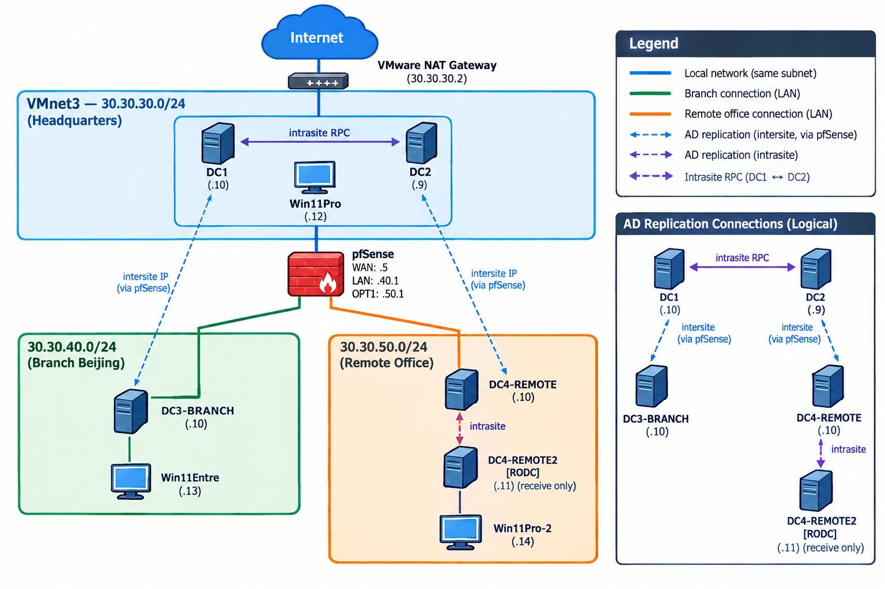

# AD DS Home Lab — Learning Journal

**KARAKIRE O'Neil** | September 2026

---

## Active Directory Domain Services — Core Concepts

A **forest** is the top-level security boundary in Active Directory. My lab forest is `oneil.local`.

A **tree** is a collection of domains that share the same contiguous namespace under a forest. For example: `hr.oneil.local`, `it.oneil.local`, `sales.oneil.local` — all under the `oneil.local` forest.

A **domain** is a logical grouping of objects — users, computers, groups, policies, and OUs — managed under one namespace.

**Organisational Units (OUs)** let admins logically organise objects within a domain. A **site** represents the physical network topology. The **schema** defines the structure of the AD database — what object types exist and what attributes they carry.

A **domain controller (DC)** is a server running Active Directory. **DNS is critical** to AD's functionality — it's used to locate domain controllers, authenticate users, and support domain join operations.

**Functional levels** control which AD features are available. There are two types: domain functional level and forest functional level.

---

## Global Catalog

A **Global Catalog (GC)** is a special role assigned to domain controllers. It keeps a full writable copy of its own domain's objects and a read-only partial copy of objects from other domains in the forest — basically a forest-wide directory index. The partial copy contains only frequently used attributes (user logon name, first name, last name, email, etc.) stored in something called the **Partial Attribute Set**.

**Ports used:**
- `389` : LDAP
- `636` : LDAP over SSL
- `3268` : Global Catalog queries
- `3269` : Global Catalog over SSL

**Global Catalog commands:**

- `nltest /dclist:oneil.local` : lists all domain controllers in the domain
- `nltest /dsgetdc:oneil.local /GC` : finds which DCs are Global Catalog servers
- `Get-ADDomainController -Filter * | Select-Object HostName, Site, IsGlobalCatalog` : shows all DCs with their GC status and site assignment
- `Test-NetConnection DC1.oneil.local -Port 3268` : tests whether a specific DC is responding on the Global Catalog port (useful for verifying GC is reachable)

To enable or disable Global Catalog on a DC: Active Directory Sites and Services > Sites > your site > Servers > the DC > right-click NTDS Settings > Properties > check or uncheck "Global Catalog."

---

## Adding a Second Domain Controller for Redundancy

I learned how to add an additional domain controller for redundancy. The process is mostly the same as setting up the first DC — install the AD DS role, run the promotion wizard — but instead of selecting "Add a new forest," I selected "Add a domain controller to an existing domain" and pointed it at `oneil.local`.

One thing I need to emphasise because I learned it the hard way: **DHCP on the second DC is not configured the same way as the first.** You don't just create an identical scope on DC2. Instead, you go to the main domain controller (DC1), right-click the existing scope, and configure failover — adding DC2 as a hot standby partner with 5% of addresses reserved for it. If you duplicate the scope manually, both servers hand out addresses from the same range without coordinating, and you get IP conflicts.

---

## Active Directory Replication

Replication takes all the OUs, workstations, users, group policies, objects, passwords, and configurations from one DC and replicates them to the others. This is handled automatically by the **KCC (Knowledge Consistency Checker)**, which builds the replication topology and determines which DCs replicate with which.

**Replication commands:**

- `repadmin /replsummary` : shows the replication summary across all DCs — useful for diagnosing when the last replication happened and if there were any errors
- `repadmin /showrepl` : shows detailed replication info per partition — useful to pinpoint exactly which partition is failing and with which partner
- `repadmin /syncall /APed` : forces replication across all DCs and all partitions (A=all partitions, P=push, e=enterprise/cross-site, d=show by distinguished name)
- `repadmin /replicate DC1 DC3-BRANCH DC=oneil,DC=local` : forces a specific partition sync from one DC to another — surgical precision when you only need one partition fixed
- `repadmin /showconn` : shows all replication connections — who pulls from whom, whether intrasite or intersite, and whether auto-generated by KCC or manually created
- `repadmin /istg` : shows which DC is the Inter-Site Topology Generator for each site — the DC responsible for calculating replication paths between sites
- `repadmin /kcc DC1` : forces the KCC to recalculate the replication topology on a specific DC
- `repadmin /bridgeheads` : shows the bridgehead servers responsible for inter-site replication

---

## FSMO Roles (Flexible Single Master Operations)

These are roles that ensure certain critical operations are only performed by one DC at a time, preventing conflicts. There are two categories:

**Forest-wide roles:**

- **Schema Master** — the only DC allowed to modify the AD schema (the blueprint of object types and attributes). Rarely used, mainly during major software installs or AD upgrades.
- **Domain Naming Master** — controls adding or removing entire domains from the forest and ensures no two domains share the same name. Very rarely used.

**Domain-wide roles:**

- **PDC Emulator** — handles password change verification (checks with this DC before rejecting a password in case it was recently changed on another DC), acts as the authoritative time source for the domain, and serves as the default target for GPO edits. This is the most active FSMO role and the one whose loss is felt fastest.
- **RID Master** — allocates pools of unique Relative Identifiers to each DC so that when multiple DCs create objects simultaneously, no two objects end up with the same SID. It hands out pools to DCs, not individual IDs to objects — so if the RID Master goes down, DCs can still create objects using their remaining pre-allocated pool.
- **Infrastructure Master** — updates cross-domain references when objects in other domains change. Only relevant in multi-domain environments.

**FSMO commands:**

- `netdom query fsmo` : shows which DC currently holds each of the five FSMO roles
- `Move-ADDirectoryServerOperationMasterRole -Identity "DC2" -OperationMasterRole 0,1,2,3,4` : transfers all five roles to another DC (0=PDC, 1=RID, 2=Infrastructure, 3=Schema, 4=DomainNaming)

---

## Active Directory Sites and Services

This console represents the physical structure of your Active Directory — where your servers actually are in the real world. I created three sites to represent my lab's physical locations: ONEIL-HeadOffice (30.30.30.0/24), ONEIL-BranchOffice-Beijing (30.30.40.0/24), and ONEIL-RemoteOffice (30.30.50.0/24).

I assigned each DC to its respective site and created subnet objects linked to each site. This helps the KCC map where all the DCs are and build efficient replication paths between them. It also means clients authenticate with the nearest DC — a laptop in Beijing talks to DC3-BRANCH, not DC1 at headquarters.

**Sites and Services commands:**

- `repadmin /istg` : shows which server is generating the topology in each site
- `repadmin /showconn` : shows the topology connections between DCs

---

## DNS — Forward and Reverse Lookup Zones

DNS in Active Directory has two types of lookup zones:

**Forward Lookup Zone** — resolves a name to an IP address. "I know the name `DC1.oneil.local`, what's the IP?" Answer: `30.30.30.10`. This is created automatically during AD DS promotion because AD literally cannot function without it.

**Reverse Lookup Zone** — resolves an IP address back to a name. "I know the IP `30.30.30.10`, which machine is that?" Answer: `DC1.oneil.local`. Uses PTR (Pointer) records. This is NOT created automatically because AD doesn't strictly require it to function.

**Why reverse zones matter:**

- **nslookup diagnostics** — without a reverse zone, nslookup shows "Server: Unknown" because it can't reverse-resolve the DNS server's IP to a hostname. I had this exact issue — setting DC1's DNS to `30.30.30.10` instead of `127.0.0.1` fixed it because the reverse zone existed for the `30.30.30.x` range but not for the loopback address.
- **Security logging** — when you see a suspicious connection from `30.30.30.45` in your logs, reverse lookup immediately tells you which machine it is.
- **Email anti-spam** — mail servers do reverse lookups to verify senders.

**Important:** when creating a reverse zone, make sure to check "Store the zone in Active Directory" — without this, the "Allow only secure dynamic updates" option isn't available.

I created reverse lookup zones for all three subnets (30.30.30.0/24, 30.30.40.0/24, 30.30.50.0/24) as AD-integrated zones with secure dynamic updates.

---

## DNS — SRV Records and Site-Aware Authentication

This is how AD clients find the right domain controller automatically. When a domain-joined machine boots up, it doesn't randomly pick a DC — it queries DNS for **SRV (Service) records** specific to its AD site.

**DNS SRV commands:**

- `nslookup -type=SRV _ldap._tcp.ONEIL-BranchOffice-Beijing._sites.dc._msdcs.oneil.local` : shows which DC serves LDAP for the Beijing site — returns `DC3-Branch.oneil.local` on port 389
- `Resolve-DnsName -Name _ldap._tcp.dc._msdcs.oneil.local -Type SRV` : PowerShell equivalent — lists all DCs providing LDAP services domain-wide
- `Resolve-DnsName -Name _kerberos._tcp.dc._msdcs.oneil.local -Type SRV` : shows which DCs are handling Kerberos authentication
- `Resolve-DnsName -Name _ldap._tcp.gc._msdcs.oneil.local -Type SRV` : shows which DCs are Global Catalog servers via SRV records

This is the mechanism that makes a laptop in Beijing authenticate against DC3-BRANCH locally instead of reaching all the way back to DC1 at headquarters.

---

## DNS and DC Health Checks

**DC health commands:**

- `dcdiag /v` : gives detailed DC health — runs all tests verbosely
- `dcdiag /test:dns /v` : one of the most important DNS-specific health checks
- `dcdiag /test:DFSREvent` : tests DFSR (SYSVOL replication) specifically — frequently fails in labs due to VM shutdowns causing temporary RPC errors that clear themselves
- `dcdiag /s:DC1` : runs all diagnostics targeting a specific DC

**DNS validation commands:**

- `nslookup oneil.local` : confirms basic DNS resolution for the domain
- `ipconfig /all` : shows what DNS servers the machine is using
- `nltest /dclist:oneil.local` : lists all domain controllers in the domain
- `Get-DnsClientServerAddress` : PowerShell equivalent showing DNS client settings

**Critical DNS zones to validate in DNS Manager:**

- Forward Lookup Zones (oneil.local)
- Reverse Lookup Zones (for each subnet)
- `_msdcs.oneil.local` (contains SRV records for DC locator)

**Important note about dcdiag results:** always check the **timestamps** in the event log, not just whether it says "passed" or "failed." An error from 14 hours ago followed by a success is completely different from an error 3 minutes ago. In a lab environment, temporary errors from VM shutdowns/restarts are expected and not a sign of a real problem.

---

## Setting Up pfSense — The Full Journey

### Why I Needed pfSense

I'm running four Windows Server 2025 VMs and three Windows 11 client PCs in VMware Workstation, spread across three subnets to simulate a multi-site enterprise. VMs on different subnets can't talk to each other without a router between them. pfSense became my dedicated firewall/router VM, and it turned out to be one of the most educational parts of the whole lab.

### The Network Topology



### Installation — Fighting the Great Firewall

I downloaded the AMD64 ISO, created a FreeBSD 14 VM in VMware with three NICs pointed at my three VMnets. My first mistake was setting the RAM to 256MB — pfSense needs at least 512MB, and I bumped it to 1GB after the installer started hanging.

The real nightmare was the package download. pfSense's installer needs to pull 179 packages (298 MiB) from pkg.pfsense.org, and the Great Firewall was blocking the connection. The fix was running Hiddify in TUN mode on my host PC — since VMware NAT routes all VM traffic through the host's network stack, TUN mode captures pfSense's outbound traffic and pushes it through the VPN tunnel.

### Interface Assignment and IP Configuration

After installation, I used the console to assign all three interfaces (WAN → em0, LAN → em1, OPT1 → em2) and configure static IPs:

- **WAN (em0):** 30.30.30.5/24, gateway 30.30.30.2 (VMware NAT), DNS 30.30.30.10
- **LAN (em1):** 30.30.40.1/24, no gateway, no DHCP
- **OPT1 (em2):** 30.30.50.1/24, no gateway, no DHCP

### Firewall Rules — The Biggest Gotcha

After installation, cross-subnet pinging was inconsistent. Three separate issues:

1. **OPT1 had no rules** — completely empty, blocking all traffic by default. Added a pass rule for OPT1 subnets.
2. **Windows Firewall on DC3** blocked ICMP from different subnets — had to enable the ICMPv4-In inbound rule.
3. **WAN had zero firewall rules** — after adding static routes on headquarters machines, traffic was directed at pfSense's WAN interface which blocked everything inbound by default. Added a WAN pass rule for WAN subnets.

Also had to uncheck "Block RFC1918 Private Networks" and "Block bogon networks" on WAN since the entire lab uses private addressing.

### Static Routes and DHCP Relay

Every headquarters machine needed persistent static routes:

```
route -p add 30.30.40.0 mask 255.255.255.0 30.30.30.5
route -p add 30.30.50.0 mask 255.255.255.0 30.30.30.5
```

For DHCP, I configured pfSense as a DHCP relay instead of running separate DHCP servers per subnet — forwarding requests to DC1 and DC2 at headquarters. This maps directly to the CCNA concept of `ip helper-address`.

### Key Lessons

1. pfSense blocks all inbound WAN traffic by default — WAN firewall rules must be explicitly added.
2. "Block RFC1918 Private Networks" must be unchecked when WAN is on a private subnet.
3. Every machine needs a static route to reach subnets on the other side of pfSense.
4. Windows Firewall blocks ICMP from different subnets by default.
5. Always verify hostnames match expectations — DC3 vs DC3-Branch caused DNS lookup failures.
6. In China, run your VPN in TUN mode on the host before installing pfSense.
7. Proxy ARP can make things appear to work when they shouldn't — use explicit static routes.

---

## Read-Only Domain Controller (RODC)

An RODC holds a read-only copy of the Active Directory database. It can authenticate users and respond to LDAP queries, but it cannot write changes — no creating users, no resetting passwords, no modifying group membership. Deployed in locations where physical security isn't guaranteed.

I deployed DC4-REMOTE2 as an RODC in the Remote Office site. During setup:

- Checked the **"Read-only domain controller (RODC)"** checkbox during promotion
- Set a **delegated administrator** (`Remote.Admin`) — note that the delegated admin doesn't automatically get local logon rights. I had to use `dsmgmt` to add them to the RODC's local administrator role separately.
- Configured the **Password Replication Policy** — controls which account passwords get cached on the RODC.

**Key RODC behaviours:**

- Only appears as a Destination DSA in `repadmin /replsummary`, never as Source — read-only means it never sends changes outbound.
- Has a read-only copy of DNS — can answer queries but cannot register or update records. Point the RODC's DNS at a writable DC, not itself.

---

## Cached Credentials and Kerberos Tickets

I learned this when testing the AD Recycle Bin. I deleted a user (AdminKay), then tried to log in as that user — and it worked.

**Why:** The client PC was authenticating against DC3-Branch, which hadn't received the deletion yet (180-minute inter-site replication delay). I verified with `klist` — AdminKay had fresh Kerberos tickets issued by DC3-Branch.

**Kerberos commands:**

- `klist` : shows all active Kerberos tickets for the current user — includes which DC issued them, when they expire, and the encryption type
- `klist purge` : destroys all cached Kerberos tickets — forces the next authentication to go to a DC fresh instead of using cached tickets

**Fix:** Forced replication (`repadmin /replicate DC3-BRANCH DC1 DC=oneil,DC=local`), purged tickets (`klist purge`), and the next login was correctly rejected.

**Security lesson:** In real-world scenarios where you need to immediately revoke access, **disable the account instead of deleting it** — disabling takes effect faster. Deleting leaves a window where cached credentials or unreplicated DCs can still authenticate the user.

---

## Group Policy Management

A Group Policy is a tool used to centrally manage and configure users and computers in the domain.

**Group Policy Management Console (GPMC)** is the main tool to create, edit, link, back up, and manage GPOs. Found at Server Manager > Tools > Group Policy Management.

**Group Policy Management Editor** opens when you edit a GPO and lets you configure the actual settings.

### GPO Processing Order — LSDOU

1. **L**ocal policy
2. **S**ite level
3. **D**omain level
4. **O**rganisational **U**nit level (closest OU to the object wins)

### Two sections of GPO

**User Configuration** — wallpapers, passwords, mapped drives, logon scripts, desktop restrictions.

**Computer Configuration** — BitLocker, Windows Update, security settings, firewall settings.

### Block Inheritance

Blocks GPOs from parent OUs being applied to child OUs. Shown as a blue exclamation mark on the OU icon.

### Enforced GPO

Overrides Block Inheritance and reverses normal processing order — an Enforced domain-level GPO beats an OU-level GPO, which is the opposite of normal LSDOU. If two GPOs are both Enforced, the one linked higher in the hierarchy wins.

**Block inheritance does not override Enforced GPOs.**

### WMI Filters

Target GPOs to specific systems based on system properties. Example targeting only Windows 10/11 workstations:

```
SELECT * FROM Win32_OperatingSystem WHERE Version LIKE "10.0%" AND ProductType = "1"
```

ProductType values: 1 = Workstation, 2 = Domain Controller, 3 = Member Server.

### Loopback Processing

Changes user policies to be based on the **computer's** location instead of the **user's** location. Two modes:

- **Replace** — ignores user's GPO settings entirely, applies only the computer's user settings.
- **Merge** — applies user's settings first, layers computer's settings on top. Computer wins on conflicts.

Common use cases: kiosk PCs, conference room computers, Remote Desktop servers, training labs.

### Group Policy vs Group Policy Preferences

- **Policies** = enforced, users can't change them, settings greyed out, reverts when GPO removed.
- **Preferences** = deployed defaults, users can change them, persists when GPO removed.

### Starter GPOs

A template used to standardise new GPOs with pre-defined administrative options.

---

## GPO Troubleshooting

**GPO troubleshooting commands:**

- `gpupdate /force` : forces an immediate Group Policy refresh on the machine — both computer and user policies are re-downloaded and applied
- `gpresult /r` : shows which GPOs are currently applied to this machine and user — the first thing to run when a GPO isn't working
- `gpresult /r /scope:computer` : shows only computer policy results — requires admin privileges
- `gpresult /r /scope:user` : shows only user policy results
- `gpresult /r /s WINP11RO-3 /scope:computer` : queries a remote machine's applied GPOs from any DC
- `rsop.msc` : Resultant Set of Policy — shows the final merged result of all GPOs and which specific GPO "won" for each setting

### The troubleshooting process

1. Run `gpresult /r` on the target machine — check what's actually applying
2. Run `rsop.msc` — check which GPO is winning for the specific setting
3. Check Group Policy Management console — verify link location, inheritance, enforced status, security filtering, and WMI filters

### Real example from my lab

I moved a computer (WINP11RO-3) from the Workstation OU to the RemoteOffice_Computers OU (which had Block Inheritance enabled). The legal notice GPO should have stopped applying, but it didn't. Running `gpresult /r /scope:computer` showed the computer's DN still pointed to the old OU — because the client was getting GPO from DC3-Branch (Beijing site) which hadn't replicated the OU move yet. After forcing replication and running `gpupdate /force`, the GPO correctly stopped applying.

**Lesson:** when GPO changes aren't taking effect, always check which DC the client is talking to (`gpresult` shows "Group Policy was applied from:") and whether that DC has the latest changes.

---

## Active Directory Recycle Bin

Allows restoring deleted AD objects with almost all their attributes intact — group memberships, permissions, properties, and linked values.

### How to activate

1. Open **Active Directory Administrative Center**
2. Select your domain > **Enable Recycle Bin**
3. Confirm (irreversible once enabled)
4. Wait for replication, or force it: `repadmin /syncall /APed`
5. Verify: `repadmin /replsummary`

Deleted objects appear in the **Deleted Objects** container where you can right-click and restore them.
